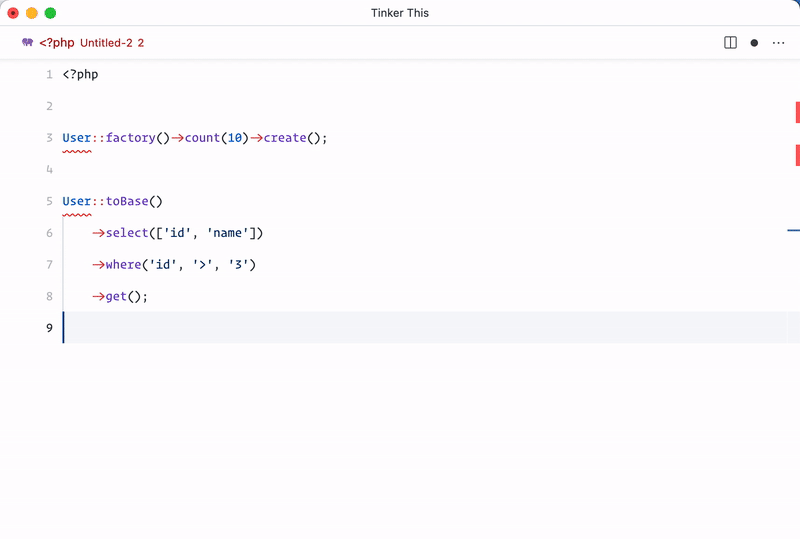

# Tinker This VS Code Extension

VS Code extension to run the selected code with Laravel Tinker

## Features

Executes php code with default Laravel Tinker, allowing to debug or test a small part of the code easily from your editor.

It allows:
- Run the selected code in the editor
- Run the current open file, when no selection is made

## Extension Settings

* `tinker-this.phpPath`: set the path to your php executable. It supports docker as `docker-compose exec -T php-fpm php`

## Known Issues

Some imports and variable may be not available if it's not part of the selected code.

## Release Notes

### v0.1

Initial release that execute php code easily with Laravel Tinker

### v0.2

Solve some issues when combining quoted and single quoted strings in the executed code 

-----------------------------------------------------------------------------------------------------------

Support the package reporting issues or new ideas on github!
